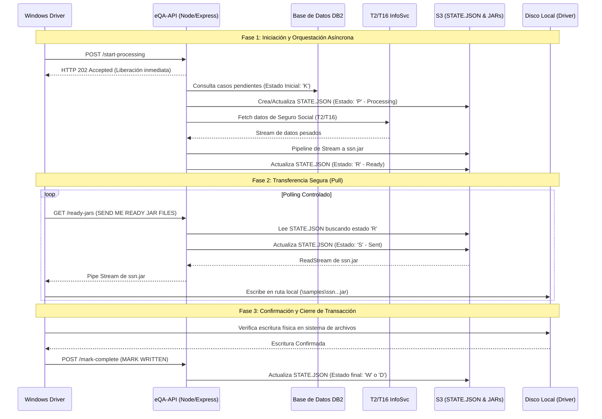

# Documento de Arquitectura y Especificación Técnica: Sistema eQA-API

## 1. Visión General del Sistema y Paradigma Arquitectónico

El sistema eQA-API actúa como el orquestador central para el procesamiento y distribución de expedientes del Seguro Social (Samples / SSN). Para garantizar la máxima escalabilidad y evitar el bloqueo del Event Loop de Node.js bajo cargas masivas, la arquitectura implementa un **paradigma asíncrono descentralizado basado en extracción (Pull-based)**.

En lugar de mantener conexiones HTTP prolongadas mientras se procesan llamadas intensivas a servicios heredados, el flujo de trabajo se divide en fases independientes. El estado de la transacción se externaliza en AWS S3 mediante un archivo `STATE.JSON`, permitiendo que el servidor Node.js/Express libere sus recursos de red inmediatamente y asegurando que el cliente (Windows Driver) controle el ritmo de descarga hacia su disco local.

## 2. Flujo de Trabajo y Diagrama de Secuencia

El proceso completo se divide en tres fases principales garantizando la idempotencia y el aislamiento de fallos:

1. **Iniciación y Procesamiento:** El Driver dispara la orden. El API consulta DB2, procesa con T2/T16 y sube el JAR empaquetado a S3.
2. **Descarga (Pull Loop):** El Driver solicita los archivos listos mediante _polling_. El API canaliza los archivos desde S3 al Driver.
3. **Confirmación de Escritura (ACK):** El Driver verifica la integridad del archivo en disco y notifica al API para cerrar el ciclo.

## 3. Máquina de Estados Descentralizada (`STATE.JSON`)

El ciclo de vida de cada _Sample_ (SSN) se rige por una máquina de estados almacenada en el archivo `STATE.JSON` dentro de S3. Esto funciona como un punto de control (Checkpointing) que previene la duplicación de procesamiento si el Driver pierde la conexión.

- **K (Not Processed):** Estado inicial que reside en la base de datos DB2 indicando los casos elegibles para recolección.
- **P (Processing):** El API ha aceptado la petición y está activamente extrayendo datos de T2/T16 InfoSvc.
- **R (Ready to Send):** El archivo JAR se ha generado y persistido con éxito en S3. Está a la espera de ser reclamado.
- **S (Sent to Driver):** El API ha iniciado la transferencia del archivo JAR hacia el Driver. Bloquea reintentos simultáneos del mismo archivo.
- **W / D (Written / Done):** Estado terminal. El Driver confirma que el archivo se ha guardado exitosamente en su disco físico.
- _Nota de Error:_ Si la escritura en el disco local del Driver falla, este envía una señal de `MARK FAILED`, permitiendo al API revertir el estado a `R` para un futuro intento.

## 4. Diseño de Resiliencia, Disponibilidad y Concurrencia

Para soportar altas cargas operativas y garantizar una alta disponibilidad en los endpoints, la arquitectura de Express implementará las siguientes estrategias a nivel de dominio e infraestructura:

### 4.1 Arquitectura de Puertos y Adaptadores (Hexagonal)

Los enrutadores de Express actuarán únicamente como mecanismos de entrega. Toda la lógica de conexión a DB2, invocación a T2/T16 y manejo de S3 residirá en adaptadores de infraestructura inyectados. Esto permite aislar los cuellos de botella de red y facilita la creación de pruebas de estrés (mocking) sin impactar el núcleo del negocio.

### 4.2 Tolerancia a Fallos y Circuit Breakers (T2/T16)

Las integraciones con T2/T16 InfoSvc son el factor de mayor riesgo para la latencia. Se implementará un patrón **Circuit Breaker** en su adaptador cliente.

- **Comportamiento:** Si el servicio del Seguro Social agota su tiempo de respuesta (timeout) o devuelve tasas altas de error (HTTP 500s), el circuito se "abrirá".
- **Beneficio:** Evita encolar procesos masivos en Node.js que eventualmente agotarían la memoria. Permite a la API marcar temporalmente los casos fallidos y responder rápidamente al cliente, para reintentar cuando el circuito evalúe que T2/T16 ha recuperado su estabilidad.

### 4.3 Manejo de Memoria Plana mediante Streams

Bajo ninguna circunstancia se almacenarán los archivos (JAR o respuestas de T2/T16) en la memoria RAM del contenedor PAAS.

- **Hacia S3:** La descarga desde T2/T16 se canalizará directamente usando `stream.pipeline` hacia el bucket S3.
- **Hacia el Driver:** Las peticiones `/ready-jars` leerán el objeto desde S3 mediante un _ReadStream_ y lo inyectarán directamente en el objeto `res` (Response) de Express. Esto garantiza un consumo de _Heap Memory_ plano independientemente de si el payload pesa 1 MB o 1 GB.

### 4.4 Endpoints Idempotentes y Control de Contrapresión

El modelo _Pull-based_ confiere el control del ritmo de trabajo al Windows Driver. Si la red del cliente experimenta degradación, Express limitará inherentemente la transferencia de paquetes de red aplicando contrapresión (_backpressure_ TCP) al flujo de S3. Sumado a la validación estricta de `STATE.JSON`, el API asegura una operatividad completamente idempotente donde las llamadas duplicadas accidentales a `/start-processing` o `/mark-complete` nunca causen corrupción de datos.
