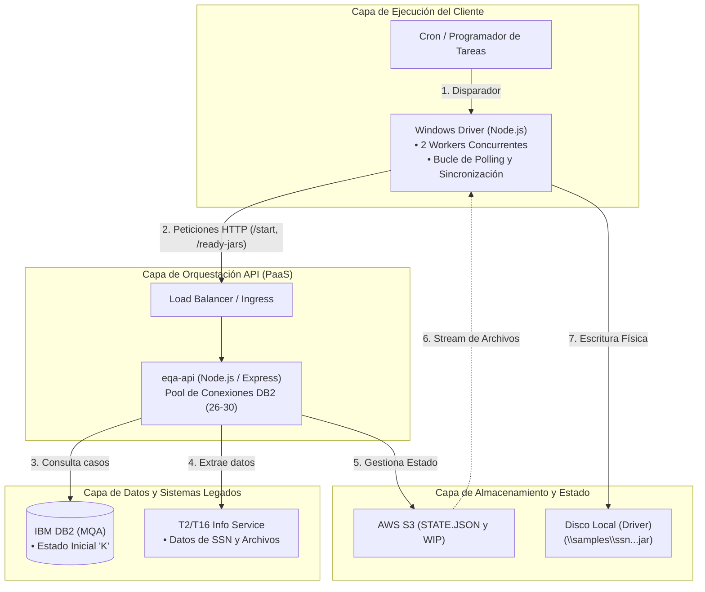
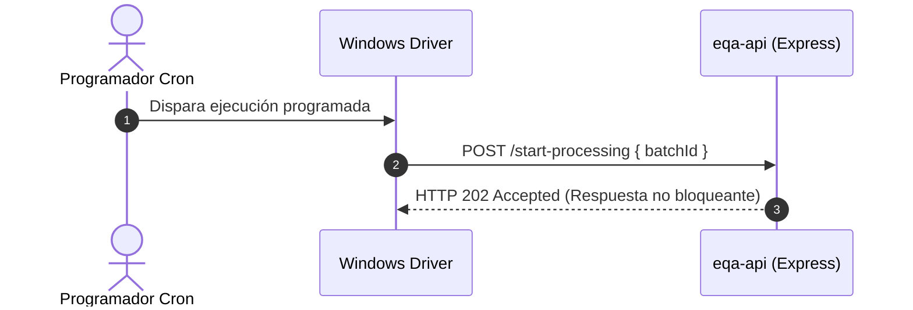
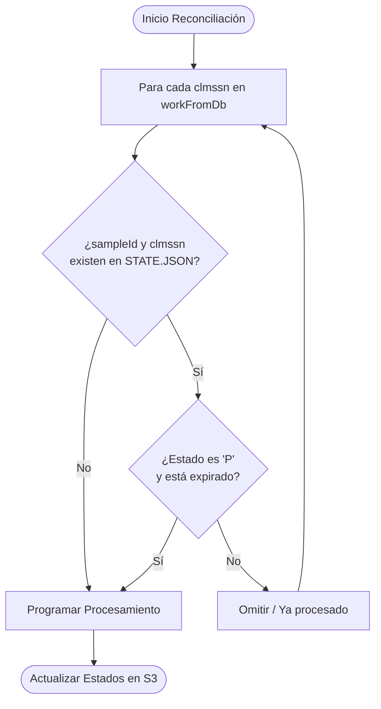

# Documentación del Proceso: Sistema eQA-API (Versión en Español)

## 1. Introducción y Resumen del Arquitectura Global

El sistema **eQA-API** es la plataforma de orquestación y procesamiento por lotes encargada de recopilar, procesar y distribuir paquetes de soporte material asociados a los Números de Seguro Social (**SSNs**) bajo el marco de revisión de garantía de calidad (**eQA / MQA**).

Para garantizar la escalabilidad y evitar bloquear el Event Loop de Node.js, la arquitectura implementa un modelo asíncrono descentralizado donde el cliente (`Windows Driver`) controla la extracción (_Pull_) y el estado se sincroniza mediante almacenamiento en la nube.



---

## 2. Paso a Paso del Proceso Operativo y Diagramas Integrados

### Paso 1: Inicio de Procesamiento (`Start Processing`)

El proceso se inicia cuando el programador de tareas activa el proceso en el cliente (`Driver`), el cual emite una petición asíncrona al API para iniciar el ciclo sin bloquear los recursos de red.



### Paso 2: Consulta a la Base de Datos (`Get Work from DB`)

El API recibe la petición y ejecuta una consulta optimizada contra la base de datos IBM DB2 para extraer los expedientes elegibles de estudio y muestra que se encuentran marcados con el estado inicial **`K`**.

- **Estructura de Datos devuelta por DB2 (Ejemplo JSON):**

```json
[
  {
    "clmssn": "001020003",
    "sample-id": "SS1202612"
  },
  {
    "clmssn": "002030004",
    "sample-id": "SS1202612"
  }
]
```

### Paso 3: Reconciliación con el Estado en S3 (`Determine What to Do / Reconcile`)

Antes de invocar servicios externos pesados, el API realiza una reconciliación cruzando la lista obtenida de la base de datos con el archivo de control de estado descentralizado (`STATE.JSON`) almacenado en AWS S3.



- **Pseudocódigo de Reconciliación:**

```text
for each clmssn in workFromDb
    if sampleId & clmssn not in State from S3
    or sampleId & clmssn in State from S3 but status = 'P' and expired
        call process.ssn
        set to 'P' in state w/ new date ts
    end if
    update state on S3

```

### Paso 4: Procesamiento y Generación de Archivos (`Process SSN`)

Para los casos validados, el API invoca de forma concurrente los servicios de datos (`T2/T16 Info Svc`), compila la información requerida (aproximadamente 50 pantallas de simulación o datos de soporte) y genera los archivos empaquetados (`.jar` o `.xml`), actualizando el estado a **`R` (Ready to Send)** en S3.

### Paso 5: Entrega por Extracción y Confirmación (`Pull-Based Delivery & ACK`)

El Windows Driver solicita los archivos mediante sondeo (_polling_), el API transmite el flujo binario aplicando contrapresión TCP, y una vez escrito en el disco local del cliente, se emite una confirmación final (`mark-complete`) para sellar el estado definitivo como **`W` / `D` (Written / Done)** en S3.

---

---

## 3. Análisis Crítico y Propuesta de Mejora Arquitectónica

Aunque el diseño actual cumple rigurosamente con los requerimientos operativos de aislamiento y resiliencia ante fallos de red mediante un modelo descentralizado, presenta importantes **desafíos de complejidad y concurrencia**:

### Puntos Críticos del Diseño Actual:

1. **Cuello de botella en el archivo centralizado (`STATE.JSON` en S3):** Modificar un único archivo JSON en S3 mediante operaciones de lectura, modificación y reescritura para cada lote o caso puede generar _race conditions_ (condiciones de carrera) si múltiples pods de Express intentan actualizar el estado simultáneamente.
2. **Carga operativa del Polling y Reconciliación en Código:** Mantener la lógica de reconciliación dentro del código de la aplicación incrementa la complejidad del mantenimiento y la probabilidad de errores de sincronización.

### Propuesta de Mejora Estructurada:

1. **Migración a Control de Estado Atómico o Redis:** Reemplazar el archivo JSON monolítico en S3 por una capa de estado basada en claves individuales por caso (`s3://bucket/states/{ssn}.json`) o utilizar una caché distribuida en memoria (Redis) con transacciones atómicas.
2. **Uso de Colas de Mensajes Gestionadas (Message Broker):** Sustituir el mecanismo manual de consulta y reconciliación por una cola de mensajes nativa (como AWS SQS o RabbitMQ). El API publica los casos extraídos de DB2 en la cola, y los workers del cliente o del backend los consumen de forma ordenada y garantizada, eliminando por completo la complejidad de la lógica de reconciliación manual.
