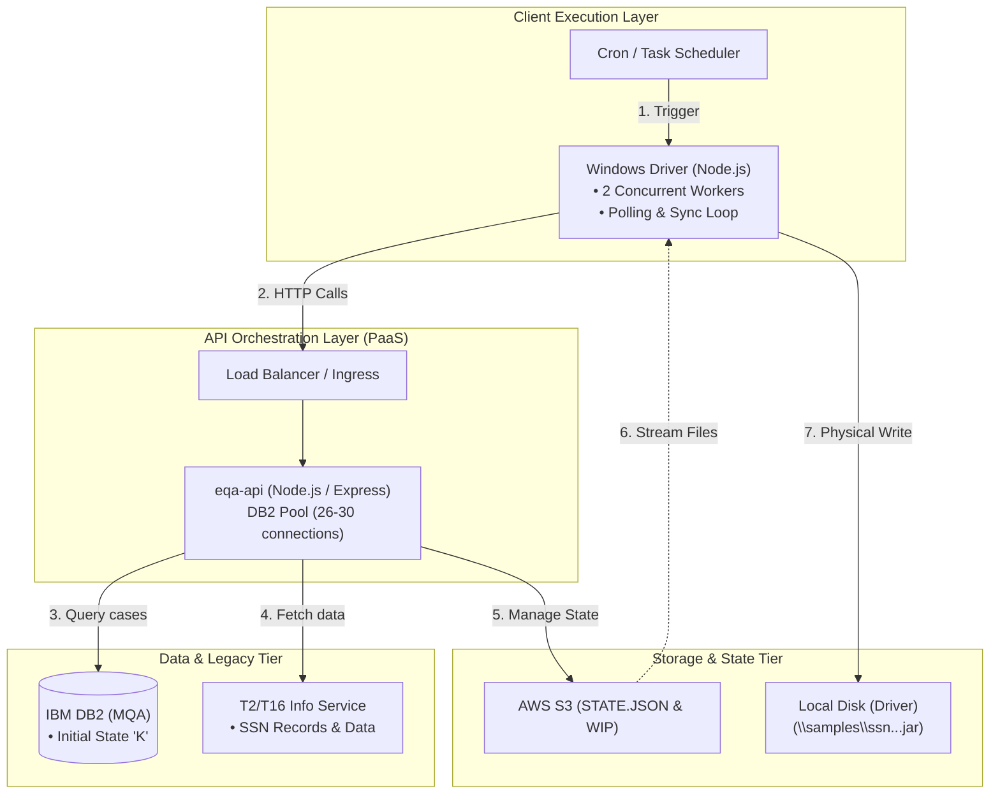
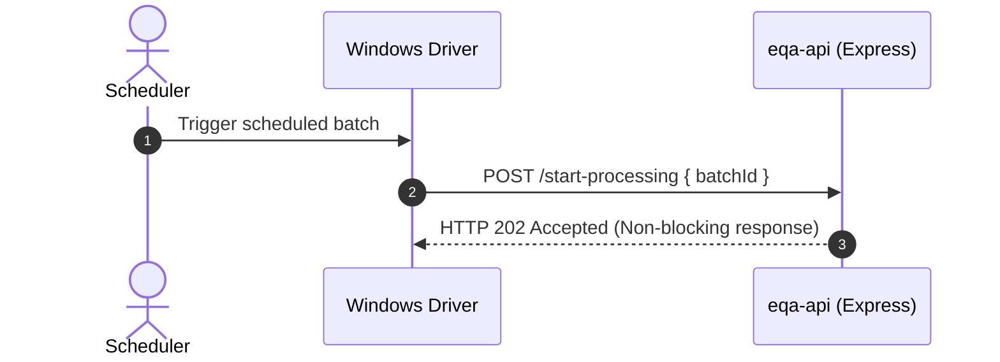
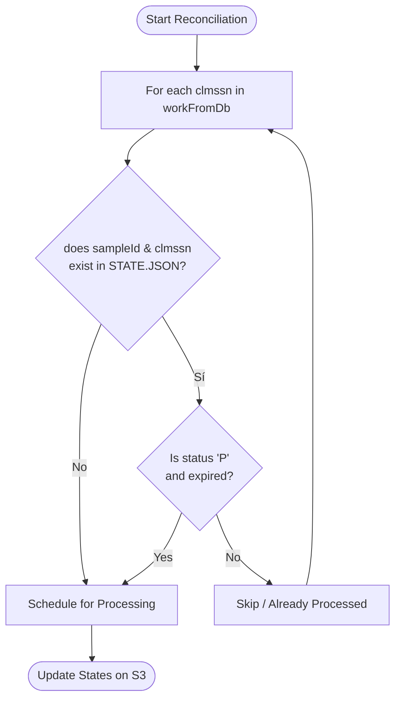

# Process Documentation: eQA-API System

## 1. Introduction and Architectural Overview

The **eQA-API** system is the enterprise batch orchestration platform responsible for gathering, processing, and distributing support material packages for Social Security Numbers (**SSNs**) under quality assurance frameworks.



---

## 2. Step-by-Step Operational Flow & Integrated Diagrams

### Step 1: Start Processing

The workflow starts when the scheduler triggers the `Driver`, which issues an asynchronous non-blocking request to the API.



### Step 2: Database Query (`Get Work from DB`)

The API queries IBM DB2 to retrieve eligible study and sample records marked with the initial status **`K`**.

- **Sample Database JSON Payload Structure:**

```json
[
  {
    "clmssn": "001020003",
    "sample-id": "SS1202612"
  }
]
```

### Step 3: State Reconciliation (`Determine What to Do / Reconcile`)

Before heavy processing, the API cross-references DB2 work items against the decentralized `STATE.JSON` file in AWS S3.


