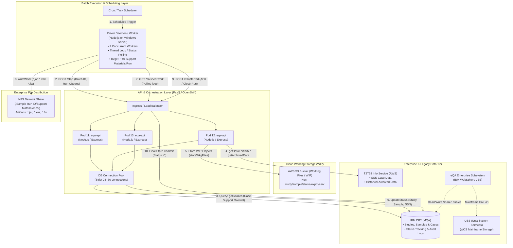
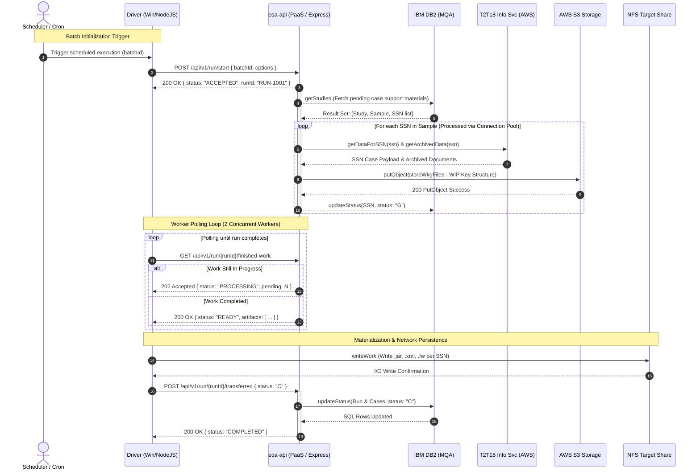
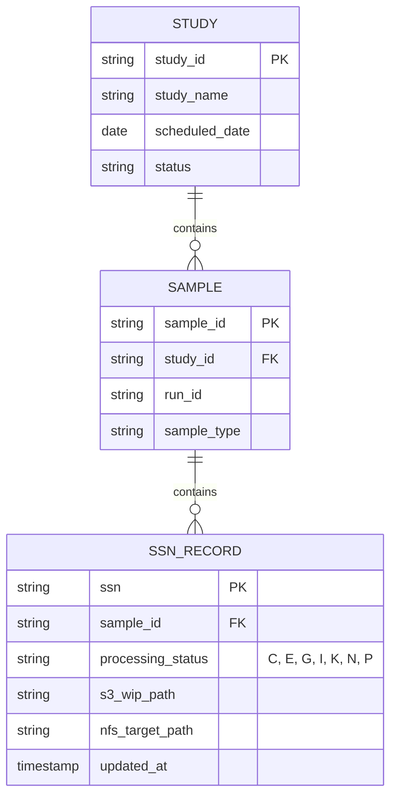
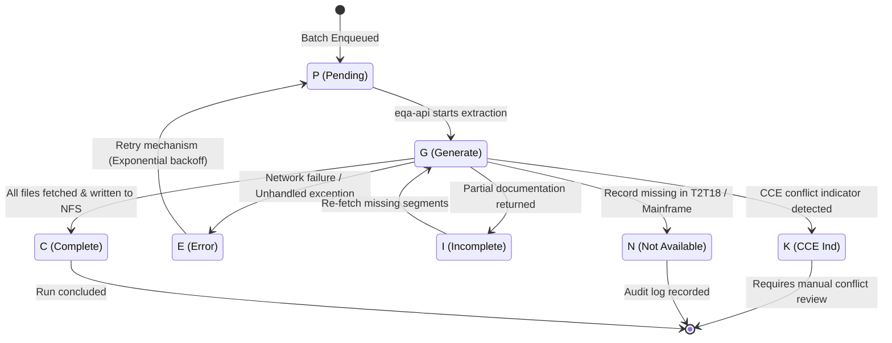

# Architecture & Technical Specification Document: eQA-API System

## 1. Executive Summary & Scope

The **eQA System** is an enterprise batch-processing and workflow orchestration platform responsible for gathering, processing, generating support material packages, and updating case states associated with Social Security Numbers (**SSNs**) under the quality assurance review framework (**eQA / MQA**).

This document formalizes the architectural whiteboard specifications into an enterprise-grade technical standard. It establishes component boundaries, synchronous and asynchronous communication flows, intermediate and long-term storage mechanisms, data models, and API messaging contracts.

---

## 2. System Architecture (C4 Container Diagram)

The system is distributed across an on-premises/virtualized Windows environment, a containerized Platform-as-a-Service (PaaS) cluster, AWS cloud services, and legacy enterprise Mainframe subsystems.



---

## 3. Component Boundaries and Responsibilities

### 3.1. `Driver` (Windows Server & Node.js)

- **Runtime Environment:** Windows Server host executing a Node.js process runtime.
- **Activation:** Triggered periodically via a `Cron` daemon or scheduled enterprise batch scheduler passing a unique `batchID`.
- **Concurrency Model:** Configured to run **2 worker threads/loops** concurrently, orchestrating batches containing approximately **40 support material packages** per execution.
- **Core Responsibilities:**
  1. Issues the initial `start` signal to `eqa-api`.
  2. Executes an active polling loop (`loop thread / get finished work`) monitoring run completion.
  3. Retrieves the processed artifacts from the API once ready.
  4. Writes and packages the files directly into the target **NFS network share** (`write work`).
  5. Emits the final `transferred` completion signal back to `eqa-api`.

### 3.2. `eqa-api` (Containerized PaaS / Node.js & Express)

- **Runtime Environment:** Containerized cloud platform (Red Hat OpenShift / Kubernetes) load-balanced across multiple pods (**Pod 11, Pod 12, Pod 13**).
- **Resource Throttling:** Strictly maintains an outbound database connection pool configured between **26 and 30 connections** to prevent connection starvation on the upstream IBM DB2 database.
- **Core Responsibilities:**
  1. Exposes the operational REST endpoints (`/start`, `/finished-work`, `/transferred`).
  2. Queries pending review studies and sample populations from **DB2 MQA**.
  3. Queries the **T2T18 Info Service** in AWS for SSN-level case records and archived historical documents.
  4. Buffers intermediate work-in-progress files (**WIP**) into **Amazon S3**.
  5. Updates operational processing flags and state transitions in **DB2 MQA**.

### 3.3. Storage Tier Architecture

- **Amazon S3 (`Store Working Files`):**
  - Serves as an ephemeral/intermediate working area for in-flight case compilation.
  - Hierarchical object key scheme:
    ```text
    s3://[bucket-name]/studies/{studyId}/samples/{sampleId}/status/{status}/expdt/{expDate}/ssn/{ssn}/wip_data.bin
    ```
- **NFS (Network File System):**
  - Target durable network repository accessible by downstream enterprise consumers:
    ```text
    /mnt/nfs/sample_runs/{batchId}/
       └── support_material/
           └── mcs/
               ├── {ssn}.jar
               ├── {ssn}_cce.jar
               ├── manifest.xml
               └── status.fw
    ```
- **IBM DB2 MQA:** Enterprise relational transactional store for studies, samples, case records, and run status indicators.
- **WebSphere JEE & USS:** Legacy core application running on IBM WebSphere and z/OS Unix System Services (USS), interacting via shared DB2 tables.

---

## 4. End-to-End Execution Sequence



---

## 5. Interface & Message Contract Matrix

The following contract matrix formalizes the interface control table outlined on the project whiteboard:

| Step / Operation      | Sender (`From`) | Receiver (`To`) | Protocol / Transport | Request Payload                                  | Response Payload                                 | Functional Description                                           |
| :-------------------- | :-------------- | :-------------- | :------------------- | :----------------------------------------------- | :----------------------------------------------- | :--------------------------------------------------------------- |
| **`start`**           | `Driver`        | `eqa-api`       | HTTP REST / POST     | `{"batchId": "B-9898", "sampleLimit": 40}`       | `{"status": "OK", "runId": "R-101"}`             | Initiates case extraction and orchestrates workers.              |
| **`get Studies`**     | `eqa-api`       | `DB2 MQA`       | TCP / SQL (Pool)     | `SELECT * FROM MQA_STUDIES WHERE STATUS = 'P'`   | Result set of records (`Study`, `Sample`, `SSN`) | Queries pending review studies and support material cases.       |
| **`getDataForSSN`**   | `eqa-api`       | `T2T18 Svc`     | HTTP REST / GET      | Param: `?ssn={ssn}&includeArchived=true`         | `{"ssn": "...", "caseData": {}, "docs": []}`     | Retrieves case data and archived records from AWS.               |
| **`storeWkgFiles`**   | `eqa-api`       | `AWS S3`        | AWS SDK / HTTPS      | Binary object stream (`wip_data.bin`)            | `{"etag": "...", "versionId": "..."}`            | Persists temporary working files under the S3 WIP key prefix.    |
| **`updateStatus`**    | `eqa-api`       | `DB2 MQA`       | SQL UPDATE           | `UPDATE SAMPLES SET STATUS = :st WHERE ID = :id` | `{"rowsAffected": 1}`                            | Updates record state transition in the database.                 |
| **`getFinishedWork`** | `Driver`        | `eqa-api`       | HTTP REST / GET      | Route: `/runs/{runId}/finished-work`             | `{"status": "READY", "files": [...]}`            | Delivers metadata, manifests, and pointers to ready files.       |
| **`writeWork`**       | `Driver`        | `NFS`           | POSIX File I/O       | Binary streams: `{ssn}.jar`, `manifest.xml`      | Disk write confirmation (`void`)                 | Materializes packaged `.jar` and `.xml` files into the NFS tree. |
| **`transferred`**     | `Driver`        | `eqa-api`       | HTTP REST / POST     | `{"runId": "R-101", "status": "C", "files": 40}` | `{"status": "ACK", "closedAt": 1774213900}`      | Confirms all files were written to NFS; flags run as complete.   |

---

## 6. Domain Model & State Machine

### 6.1. Domain Hierarchy ($1:N$)

The relationship between quality control entities follows a strict one-to-many hierarchy:

$$\text{Study} \xrightarrow{1:N} \text{Sample} \xrightarrow{1:N} \text{SSN (Individual Case)}$$



### 6.2. Lifecycle State Machine



### 6.3. Status Dictionary

- **`P` (Pending):** Record identified and queued for extraction.
- **`G` (Generate):** Active fetching from T2T18 and intermediate compilation in S3 WIP.
- **`C` (Complete):** Successfully generated, transferred, and written to NFS.
- **`E` (Error):** Communication failure, database timeout, or unrecoverable error.
- **`I` (Incomplete):** Partial documents retrieved; case missing mandatory exhibits.
- **`K` (CCE Ind):** Case flagged with a CCE conflict indicator (requires conflict resolution workflow).
- **`N` (Not Available):** No active case data or historical archives found for the SSN.

---

## 7. Infrastructure & Decommissioning Roadmap

| Milestone / Subsystem                      | Scheduled Target    | Description & Impact                                                       |
| :----------------------------------------- | :------------------ | :------------------------------------------------------------------------- |
| **Java 8 End-of-Life**                     | September 20, 2026  | Upstream Java runtime upgrades across supporting enterprise tooling.       |
| **Cobol 6 Migration**                      | August 14, 2026     | Mainframe Cobol compilation and interface update.                          |
| **POAMS MCS $\rightarrow$ CCE Transition** | Nov 2026 – Mar 2027 | Migration from legacy POAMS MCS packaging to CCE standard format (`.jar`). |
| **Laws Subsystem Decommission**            | January 2027        | Decommissioning of legacy Laws components and endpoints.                   |
| **Regional Office Realignment**            | Ongoing             | Dynamic routing changes for study samples across regional data offices.    |

### Operational Guardrails

1. **Connection Pool Cap:** Node.js DB2 clients must maintain a hard ceiling of **30 connections** (nominal operating range: 26–30) to preserve DB2 stability.
2. **Worker Concurrency:** The Windows Driver process is constrained to **2 concurrent worker loops** to avoid saturating I/O operations on the NFS share.
3. **S3 Cleanup Policy:** Configure S3 Lifecycle Policies on the WIP bucket prefix to expire working files after 7 days post-run completion.
