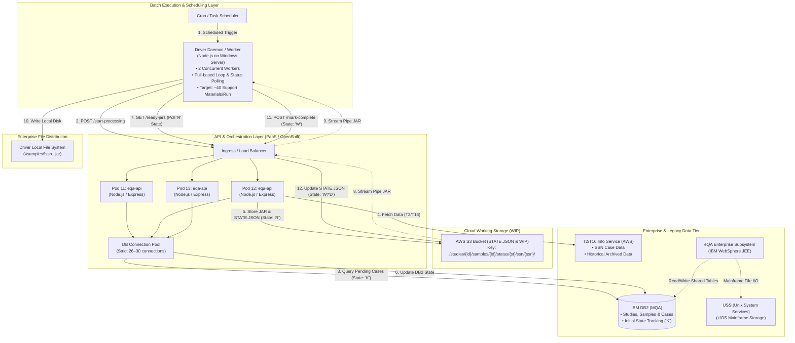
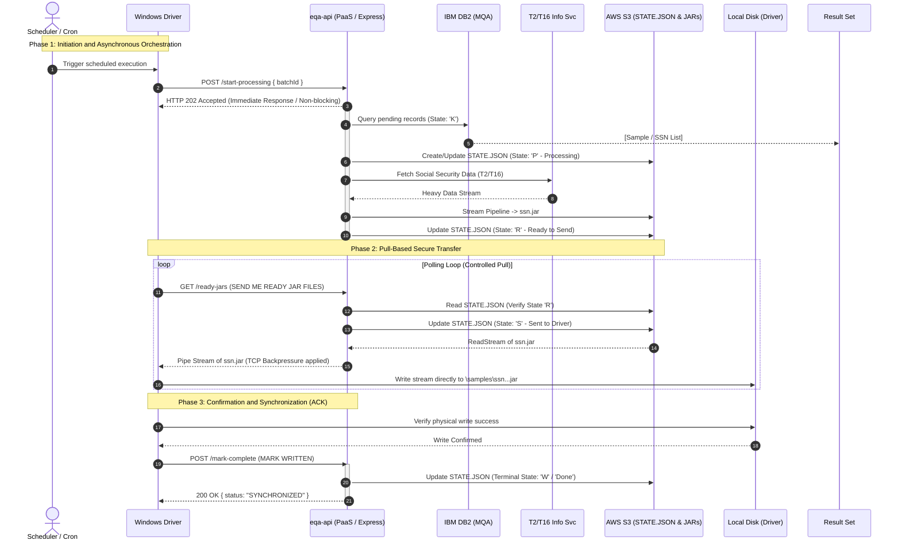

# Architecture & Technical Specification Document: eQA-API System

## 1. Executive Summary & Scope

The **eQA System** is an enterprise batch-processing and workflow orchestration platform responsible for gathering, processing, generating support material packages, and updating case states associated with Social Security Numbers (**SSNs**) under the quality assurance review framework (**eQA / MQA**).

This document formalizes the architectural whiteboard specifications into an enterprise-grade technical standard. It establishes component boundaries, asynchronous synchronization flows, intermediate storage mechanisms, the decentralized state machine (`STATE.JSON`), and API messaging contracts.

---

## 2. System Architecture (C4 Container Diagram)

The system is distributed across an on-premises/virtualized Windows environment, a containerized Platform-as-a-Service (PaaS) cluster, AWS cloud services, and legacy enterprise Mainframe subsystems.

---

## 3. Component Boundaries and Responsibilities

### 3.1. `Windows Driver` (Node.js on Windows Server)

- **Runtime Environment:** Windows Server host executing a Node.js process runtime.
- **Activation:** Triggered periodically via a `Cron` daemon or scheduled enterprise batch scheduler passing a unique `batchID`.
- **Concurrency Model:** Configured to run **2 worker threads/loops** concurrently, orchestrating batches containing approximately **40 support material packages** per execution.
- **Core Responsibilities:**

1. Issues the initial asynchronous `START PROCESSING` signal to `eqa-api`.
2. Executes an active polling loop (`SEND ME READY JAR FILES`) querying for ready artifacts.
3. Receives streamed JAR packages and stores them directly onto its local target file system (`DISK`).
4. Performs local verification and emits the final `MARK COMPLETE` (or `MARK FAILED`) acknowledgement back to the API.

### 3.2. `eqa-api` (Containerized PaaS / Node.js & Express)

- **Runtime Environment:** Containerized cloud platform (Red Hat OpenShift / Kubernetes) load-balanced across multiple pods (**Pod 11, Pod 12, Pod 13**).
- **Resource Throttling:** Strictly maintains an outbound database connection pool configured between **26 and 30 connections** to prevent connection starvation on the upstream IBM DB2 database.
- **Core Responsibilities:**

1. Exposes resilient, highly available REST endpoints for the asynchronous lifecycle.
2. Queries pending review cases from **DB2 MQA** (targeting initial state **K**).
3. Invocations to **T2/T16 Info Svc** protected via Circuit Breakers and robust error isolation.
4. Generates packaged JAR files and manages the decentralized state machine via `STATE.JSON` in **Amazon S3**.
5. Implements flat-memory streaming (`stream.pipeline`) to prevent container RAM saturation.

### 3.3. Storage Tier Architecture

- **Amazon S3 (`STATE.JSON` & WIP Work Files):**
- Acts as the decentralized checkpointing source of truth.
- Maintains run states (`P`, `R`, `S`, `W`/`D`) and transient object packages.

- **Driver Local Disk:** Target file system directory (`\samples\ssn...jar`) where the client materializes downloaded artifacts under strict backpressure.
- **IBM DB2 MQA:** Enterprise relational transactional store for initial record identification (State `K`).
- **WebSphere JEE & USS:** Legacy core application running on IBM WebSphere and z/OS Unix System Services (USS), interacting via shared DB2 tables.

---

## 4. End-to-End Asynchronous Execution Sequence

---

## 5. Interface & Message Contract Matrix

| Operation / Endpoint      | Sender (`From`) | Receiver (`To`) | Protocol / Transport | Request Payload                                   | Response Payload                           | Functional Description                                            |
| ------------------------- | --------------- | --------------- | -------------------- | ------------------------------------------------- | ------------------------------------------ | ----------------------------------------------------------------- |
| **`start-processing`**    | `Driver`        | `eqa-api`       | HTTP REST / POST     | `{"batchId": "B-9898", "sampleLimit": 40}`        | `{"status": "ACCEPTED", "runId": "R-101"}` | Triggers non-blocking background orchestration.                   |
| **`getStudies` (DB2)**    | `eqa-api`       | `DB2 MQA`       | TCP / SQL (Pool)     | `SELECT * FROM MQA WHERE STATUS = 'K'`            | Result set (`Study`, `Sample`, `SSN`)      | Queries unprocessed samples in state 'K'.                         |
| **`getDataForSSN`**       | `eqa-api`       | `T2/T16 Svc`    | HTTP REST / GET      | Param: `?ssn={ssn}`                               | `{"ssn": "...", "caseData": {}}`           | Retrieves SSN data required to build package jars.                |
| **`storeWkgFiles` (S3)**  | `eqa-api`       | `AWS S3`        | AWS SDK / HTTPS      | Binary object stream + `STATE.JSON`               | `{"etag": "...", "versionId": "..."}`      | Persists intermediate jar and updates decentralized states.       |
| **`ready-jars`** (Pull)   | `Driver`        | `eqa-api`       | HTTP REST / GET      | Route: `/ready-jars?batchId={id}`                 | Binary Stream (`*.jar`)                    | Requests ready files via polling; transitions state to 'S'.       |
| **`mark-complete`** (ACK) | `Driver`        | `eqa-api`       | HTTP REST / POST     | `{"runId": "R-101", "ssn": "...", "status": "W"}` | `{"status": "ACK", "synced": true}`        | Confirms successful local disk write; finalizes state as 'W'/'D'. |

---

## 6. Domain Model & State Machine

### 6.1. Decentralized State Machine (`STATE.JSON`)

The lifecycle of each individual record is controlled by explicit states mapped inside `STATE.JSON` on S3:

- **`K` (Not Processed):** Initial state residing in DB2 indicating cases pending collection.
- **`P` (Processing):** API has accepted the run and is actively communicating with T2/T16.
- **`R` (Ready to Send):** Artifacts generated and stored successfully in S3; awaiting driver polling.
- **`S` (Sent to Driver):** API is actively streaming the package to the client; locks concurrent duplication.
- **`W` / `D` (Written / Done):** Terminal state. Driver has confirmed successful local disk persistence.
- **`E` (Error) / `MARK FAILED`:** If client disk writing fails, the state reverts or flags as failed for retry safety.

### 6.2. System Roadmap & Compliance

| Milestone / Subsystem                      | Scheduled Target    | Description & Impact                                                       |
| ------------------------------------------ | ------------------- | -------------------------------------------------------------------------- |
| **Java 8 End-of-Life**                     | September 20, 2026  | Upstream Java runtime upgrades across supporting enterprise tooling.       |
| **Cobol 6 Migration**                      | August 14, 2026     | Mainframe Cobol compilation and interface update.                          |
| **POAMS MCS $\rightarrow$ CCE Transition** | Nov 2026 – Mar 2027 | Migration from legacy POAMS MCS packaging to CCE standard format (`.jar`). |
| **Laws Subsystem Decommission**            | January 2027        | Decommissioning of legacy Laws components and endpoints.                   |

### Operational Guardrails

1. **Connection Pool Cap:** Node.js DB2 clients maintain a strict ceiling of **30 connections** (operating range: 26–30) to preserve upstream database health.
2. **Worker Concurrency:** The Windows Driver is restricted to **2 concurrent workers** to manage network backpressure efficiently.
3. **Flat Memory Architecture:** All heavy payloads utilize Node.js `stream.pipeline` directly from T2/T16 to S3 and from S3 to Express HTTP responses, guaranteeing flat memory usage under high concurrency.
